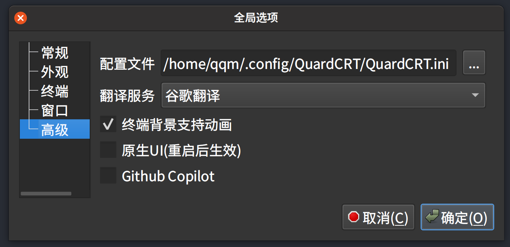

<a href="../../en/latest/configuration.html">🇺🇸 English</a> | <a href="../../zh-cn/latest/configuration.html">🇨🇳 简体中文</a> | <a href="../../zh-tw/latest/configuration.html">🇭🇰 繁體中文</a> | <a href="../../ja/latest/configuration.html">🇯🇵 日本語</a>

# 配置

QuardCRT包含全局配置和会话配置，全局配置是QuardCRT的全局设置，持久化保存在配置文件中，以方便用户的个性化使用。会话配置是针对当前具体会话的设置，一般用于临时调整会话的设置。

## 全局配置

首先，QuardCRT的全局配置文件位于 `<用户目录>/.config/QuardCRT/QuardCRT.ini` ,您也可以打开QuardCRT主界面，依次选择 选项 --> 全局选项 --> 高级 查看当前配置文件所在路径。

下面来介绍分类全局配置的各个部分。

### 常规

常规配置包括QuardCRT的一些基本设置。

- 新标签模式

    新标签模式表示当用户使用标签页➕按钮或快捷键新建标签时，新标签的打开方式。有三种模式可选：

    - 新会话：弹出快速连接对话框，用户配置新标签的连接信息，产生一个新的会话。
    - 克隆会话：复制当前标签页的会话信息，产生一个新的会话（如果当前标签页硬件资源为单一设备，会弹出快速连接对话框，用户配置不可复制的硬件资源信息）。
    - 本地终端：产生一个新的本地终端会话。

- 新标签工作目录

    当用户创建一个新的本地终端会话时，新会话的工作目录。默认情况下该选项仅包含一个选项：`用户的主目录`，如需添加其他选项，需要将其添加到目录书签中。

- 标签标题模式

    标签标题模式表示标签页标题的显示方式。有三种模式可选：

    - 简要：固定宽度显示，不显示完整的会话标题。
    - 完整：显示完整的会话标题。
    - 滚动：显示完整的会话标题，当标题过长时，会自动滚动显示。

- 标签标题宽度

    当标签标题模式为简要/滚动时，标签标题的固定宽度。单位为像素。

- 标签预览

    当用户鼠标悬停在标签页上时，显示标签页的预览信息。

- 预览窗口宽度

    标签预览窗口的宽度。单位为像素。

### 外观

外观配置包括终端的外观设置。

- 配色方案

    QuardCRT提供了数十种配色方案供用户选择，用户可以根据自己的喜好选择合适的配色方案。

- 字体
    
    终端的字体设置，包括字体名称、字体大小。其中Built-in表示QuardCRT内置的字体，用户也可以选择系统中已安装的字体。Built-in字体选择了适合编程的等宽字体，用户如需要将已选择的其他字体变更为Built-in字体，可以在选择字体时点击取消按钮，即可恢复为Built-in字体。

- 背景图片

    终端的背景图片设置，用户可以选择自己喜欢的背景图片作为终端的背景。支持的图片格式有：bmp、jpg、jpeg、png、gif。gif格式的图片会以动画的形式显示在终端背景上。如果在高级选项中勾选了`终端背景支持动画`，则还可以选择mp4、avi、mov、wkv等视频格式作为终端的背景，但这会消耗大量的系统资源。点击清除按钮可以清除当前的背景图片选择。

- 背景模式

    终端的背景模式，有六种模式可选：

    - 无：不对背景图片大小进行调整。
    - 拉伸：拉伸背景图片以适应终端的大小。
    - 缩放：缩放背景图片以适应终端的大小。
    - 适应：保持背景图片的纵横比例，使背景图片完全显示在终端中。
    - 居中：将背景图片居中显示在终端中。
    - 平铺：平铺背景图片以填充整个终端。

- 背景图片透明度

    终端的背景透明度，取值范围为0-100，0表示完全透明，100表示完全不透明。

### 终端

终端配置包括终端的一些基本设置。

- 滚动行数

    终端的滚动行数，表示终端中最多缓存的行数。较大的值会占用更多的内存。

- 光标样式

    终端的光标样式，有三种样式可选：

    - 块状：显示为一个实心的矩形块。
    - 下划线：显示为一个下划线。
    - I线：显示为一条竖线。

- 光标闪烁

    终端的光标闪烁。勾选表示光标会闪烁。

- 单词字符

    表示将那些特殊字符视作单词的一部分，用于双击选择单词。默认情况下：`@-./_~`。

### 窗口

窗口配置包括QuardCRT的窗口设置。

- 窗口透明度

    整个应用程序窗口透明度，取值范围为0-100，0表示完全透明，100表示完全不透明。

### 高级

高级配置包括QuardCRT的一些高级设置。

- 配置文件路径

    QuardCRT的配置文件路径，用户可以在此处查看当前配置文件所在路径。

- 翻译服务
    
    QuardCRT的翻译服务，用户可以选择使用谷歌翻译\百度翻译\必应翻译。

- 终端背景支持动画

    勾选表示终端背景支持动画，用户可以选择mp4、avi、mov、wkv等视频格式作为终端的背景，但这会消耗大量的系统资源。

- 原生UI

    勾选表示使用原生UI，主要用于MacOS用户，勾选后QuardCRT的UI会更加符合MacOS的风格。但多平台用户不建议勾选，以保持QuardCRT的统一风格和使用习惯。（此选项需要重启QuardCRT才能生效）

- Github Copilot

    This feature is not yet available, please look forward to it.
