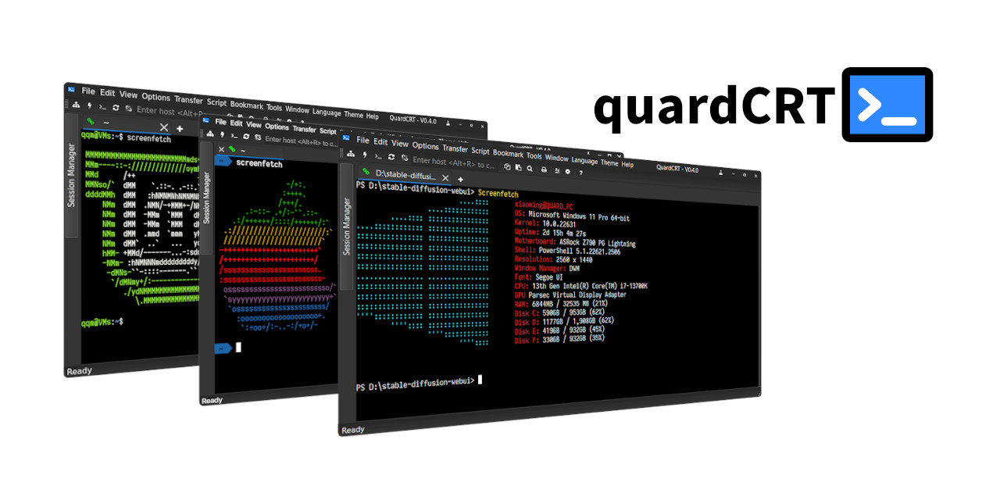

.. raw:: html

   
<a href="../../en/latest/index.html">🇺🇸 English</a> | <a href="../../zh-cn/latest/index.html">🇨🇳 简体中文</a> | <a href="../../zh-tw/latest/index.html">🇭🇰 繁體中文</a> | <a href="../../ja/latest/index.html">🇯🇵 日本語</a>

quardCRT
----------------------------------

.. image:: https://img.shields.io/github/actions/workflow/status/qqxiaoming/quardCRT/windows.yml?branch=main&logo=windows
   :target: https://github.com/QQxiaoming/quardCRT/actions/workflows/windows.yml
   :alt: Windows ci
.. image:: https://img.shields.io/github/actions/workflow/status/qqxiaoming/quardCRT/linux.yml?branch=main&logo=linux
   :target: https://github.com/QQxiaoming/quardCRT/actions/workflows/linux.yml
   :alt: Linux ci
.. image:: https://img.shields.io/github/actions/workflow/status/qqxiaoming/quardCRT/macos.yml?branch=main&logo=apple
   :target: https://github.com/QQxiaoming/quardCRT/actions/workflows/macos.yml
   :alt: Macos ci
.. image:: https://img.shields.io/codefactor/grade/github/qqxiaoming/quardCRT.svg?logo=codefactor
   :target: https://www.codefactor.io/repository/github/qqxiaoming/quardCRT
   :alt: CodeFactor
.. image:: https://readthedocs.org/projects/quardcrt/badge/?version=latest
   :target: https://quardcrt.readthedocs.io/en/latest/?badge=latest
   :alt: Documentation Status
.. image:: https://img.shields.io/github/license/qqxiaoming/quardCRT.svg?colorB=f48041&logo=gnu
   :target: https://github.com/QQxiaoming/quardCRT
   :alt: License
.. image:: https://img.shields.io/github/v/tag/QQxiaoming/quardCRT?filter=V*&logo=git
   :target: https://github.com/QQxiaoming/quardCRT/releases
   :alt: GitHub tag (latest SemVer)
.. image:: https://img.shields.io/github/downloads/QQxiaoming/quardCRT/total.svg?logo=pinboard
   :target: https://github.com/QQxiaoming/quardCRT/releases
   :alt: GitHub All Releases
.. image:: https://img.shields.io/github/stars/QQxiaoming/quardCRT.svg?logo=github
   :target: https://github.com/QQxiaoming/quardCRT
   :alt: GitHub stars
.. image:: https://img.shields.io/github/forks/QQxiaoming/quardCRT.svg?logo=github
   :target: https://github.com/QQxiaoming/quardCRT
   :alt: GitHub forks
.. image:: https://gitee.com/QQxiaoming/quardCRT/badge/star.svg?theme=dark
   :target: https://gitee.com/QQxiaoming/quardCRT
   :alt: Gitee stars
.. image:: https://gitee.com/QQxiaoming/quardCRT/badge/fork.svg?theme=dark
   :target: https://gitee.com/QQxiaoming/quardCRT
   :alt: Gitee forks

quardCRT一款多功能终端仿真/图形桌面软件，支持多种后端协议，无依赖跨平台使用，windows/linux/mac使用体验完全一致，支持多标签页和历史记录管理等传统终端软件功能，同时支持一些独具特色的细节功能。quardCRT的设计宗旨是创建尽可能用户友好、功能丰富、且跨平台一致性体验的终端软件，相比很多专业高性能终端，quardCRT会更适合入门、轻度用户快速的配置好所需的终端环境，但这也并不意味quardCRT不追求高性能。

.. list-table:: 
   :widths: 33 33 33
   :header-rows: 0

   * - .. image:: ./img/windows.png
          :align: center
          :height: 160px
     - .. image:: ./img/macos.png
          :align: center
          :height: 160px
     - .. image:: ./img/linux.png
          :align: center
          :height: 160px
   * - Windows
     - MacOS
     - Linux

----------------------------------
功能
----------------------------------

- **跨平台**: Windows, MacOS, Linux
- **多种协议**: SSH, Telnet, Serial, LocalShell, RawSocket, NamedPipe, VNC
- **多会话**: 多标签，多窗口，多监视器，浮动窗口
- **多语言**: 简体中文，繁体中文，英语，日语，韩语，西班牙语，法语，俄语，德语，葡萄牙语(巴西)，捷克语，阿拉伯语
- **多主题**: 亮色，暗色
- **会话历史管理**: 会话历史管理，会话历史搜索
- **会话管理**: 会话管理，会话导入导出
- **HEX显示**: HEX显示
- **文件传输**: SFTP, Xmodem, Ymodem, Zmodem, Kermit
- **脚本**: 脚本录制，脚本回放
- **终端定制**: 终端字体，颜色，大小，光标，回滚，背景等

----------------------------------
特别功能
----------------------------------

- 标签浮动预览
- 支持浮动窗口，标签拖拽到浮动窗口
- SSH2会话一键打开SFTP文件传输窗口
- 工作目录书签
- 自动发送
- 终端背景图支持gif动画和视频
- 终端关键字高亮匹配
- 选中文本翻译功能
- 路径匹配一键直达
- 工作路径直达
- Windows本地终端增强（Tab键选择完整命令等）

----------------------------------
插件
----------------------------------

quardCRT从V0.4.0版本开始支持插件，插件将以Qt插件的形式提供，以动态库的形式加载，关于插件开发信息的更多了解，请参考插件开放平台 `platform <https://github.com/QuardCRT-platform>`_ 。该平台将提供插件开发的模板仓库和相关示例。目前插件功能还处于早期开发阶段，如果您有好的想法或建议，请在 `GitHub <https://github.com/QQxiaoming/quardCRT>`_ 或 `Gitee <https://gitee.com/QQxiaoming/quardCRT>`_ 上提交issues或讨论。

----------------------------------
从商店安装
----------------------------------

.. image:: https://get.microsoft.com/images/zh-cn%20dark.svg
   :target: https://apps.microsoft.com/detail/quardCRT/9p6102k9qb3t?mode=direct
   :alt: Microsoft Store

.. toctree::
   :maxdepth: 3
   :caption: 目录:

   安装<installation.md>
   使用<usage.md>
   配置<configuration.md>
   脚本<scripts.md>
   插件<plugins.md>
   常见问题<faq.md>
   贡献<contributing.md>
   更新日志<changelog.md>
   许可证<license.md>
   路线图<roadmap.md>
   致谢<acknowledgements.md>
   隐私<privacy.md>
 