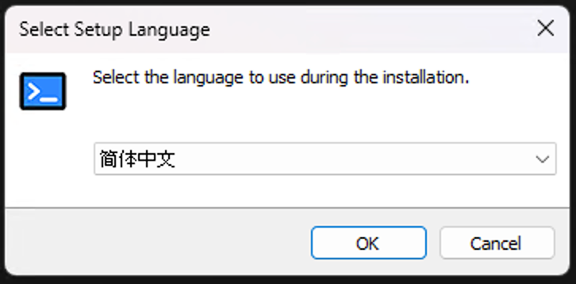
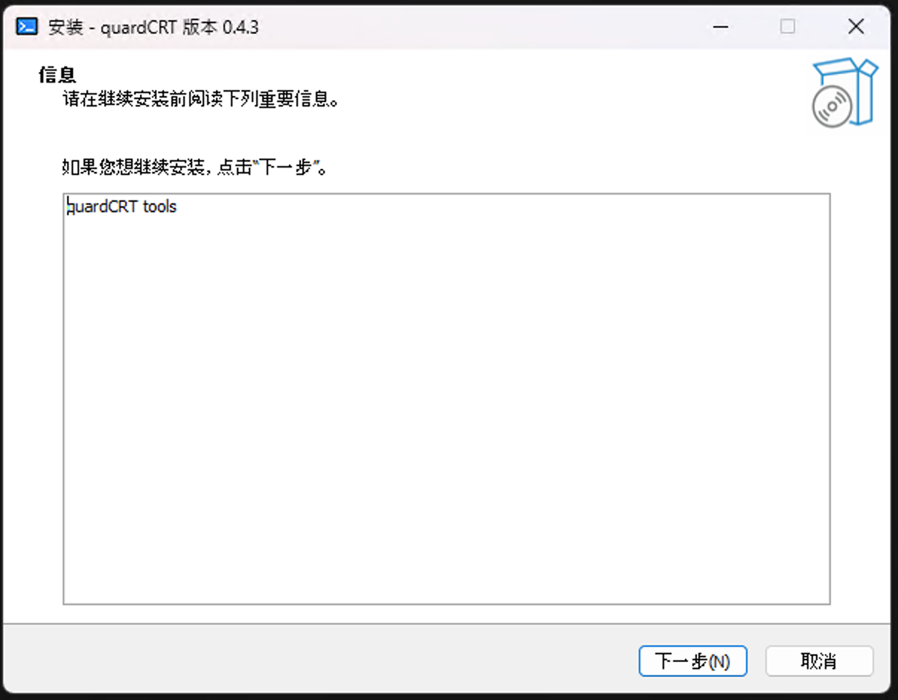
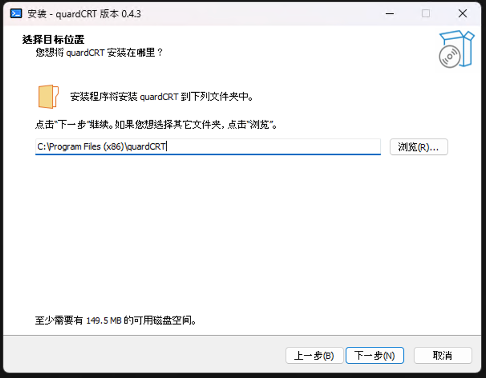
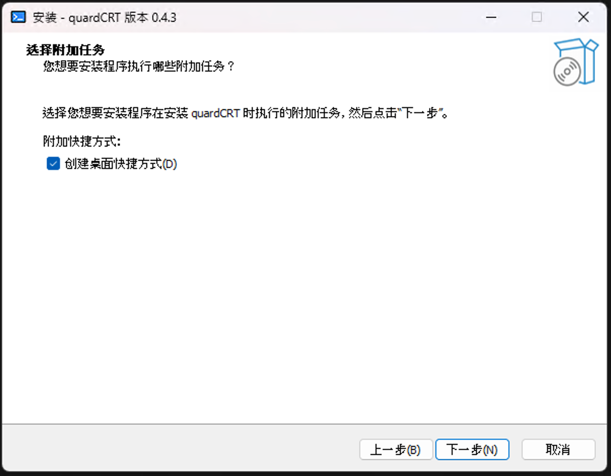
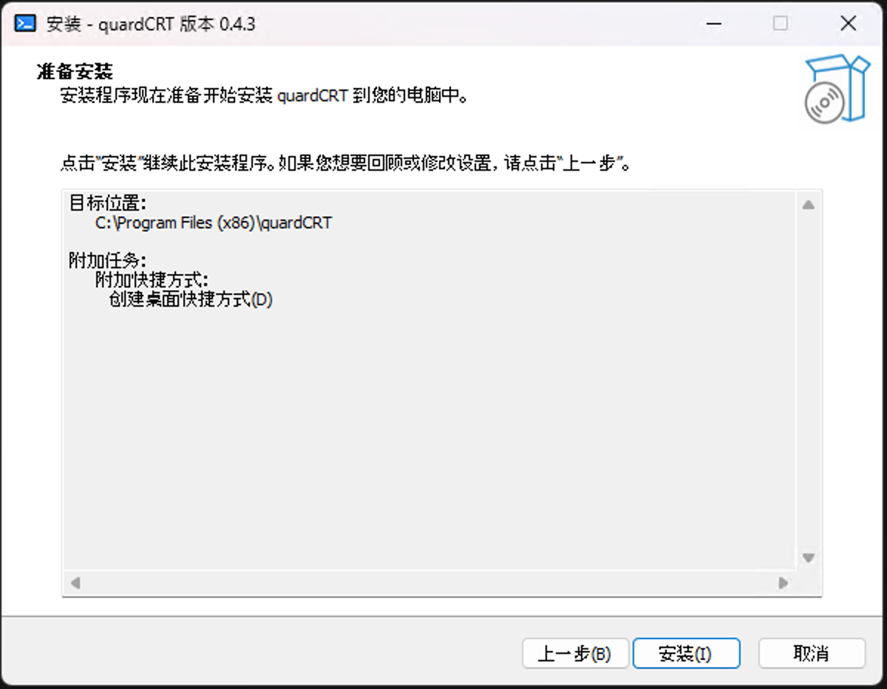
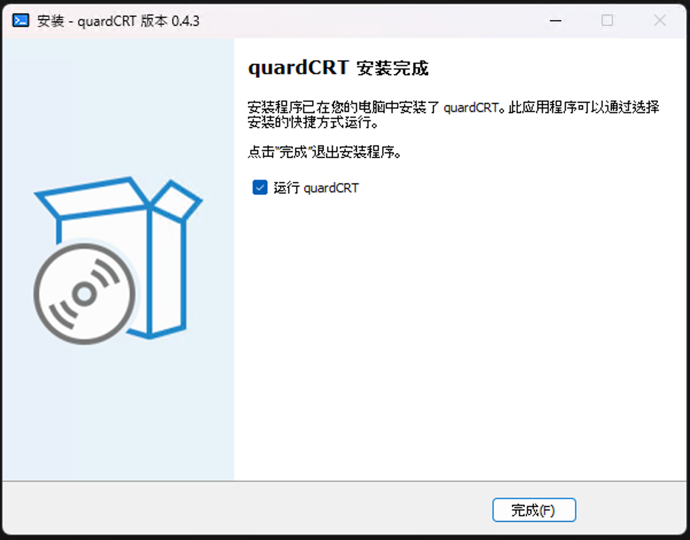
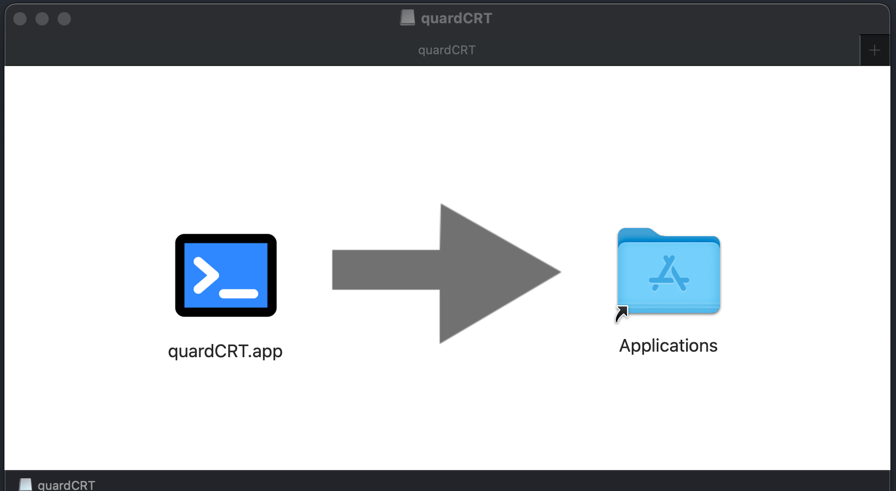
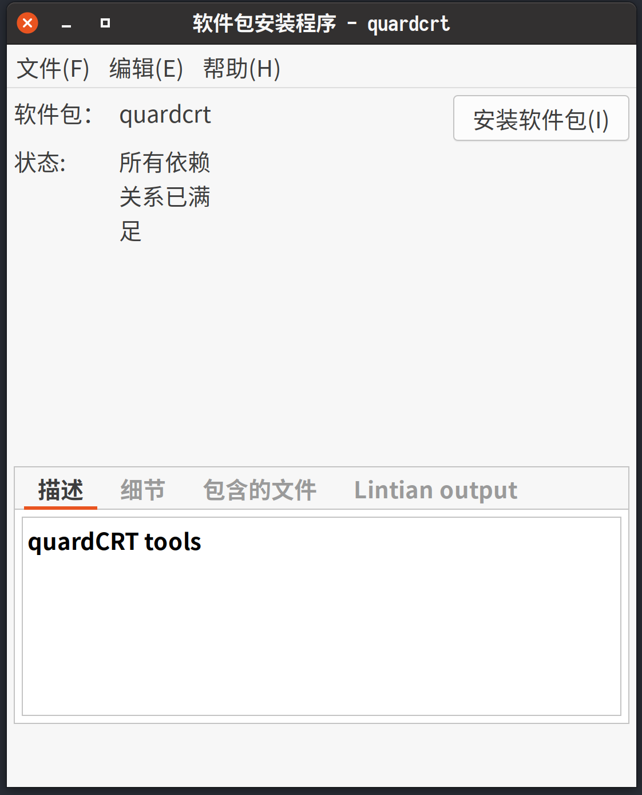
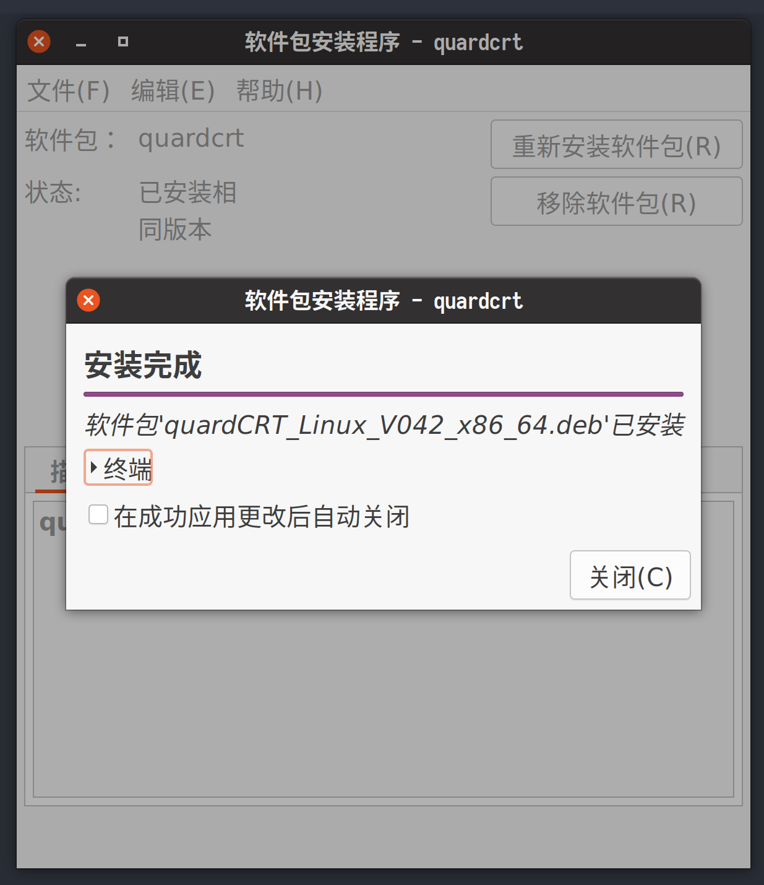

<div style="text-align: right"><a href="../../en/latest/installation.html">🇺🇸 English</a> | <a href="../../zh-cn/latest/installation.html">🇨🇳 简体中文</a> | <a href="../../zh-tw/latest/installation.html">🇭🇰 繁體中文</a> | <a href="../../ja/latest/installation.html">🇯🇵 日本語</a></div>

# 安装

QuardCRT 是一个跨平台的终端模拟器，它支持 Windows、MacOS 和 Linux。你可以根据你的平台下载对应的包。

## 下载

### 所有平台

如果你想下载 QuardCRT 的最新版本，你可以前往以下链接：

- [GitHub Releases](https://github.com/QQxiaoming/quardCRT/releases)
- [Gitee Releases](https://gitee.com/QQxiaoming/quardCRT/releases)
- [SourceForge](https://sourceforge.net/projects/quardcrt/files/)

你应该根据你的平台下载对应的包。我们提供以下包：

- Windows: 
    - `quardCRT_windows_Vxxx_x86_64_setup.exe`
    - `quardCRT_windows_Vxxx_x86_64_msvc_setup.exe`
- MacOS: 
    - `quardCRT_macos_Vxxx_x86_64.dmg`
    - `quardCRT_macos_Vxxx_arm64.dmg`
- Linux: 
    - `quardCRT_Linux_Vxxx_x86_64.AppImage`
    - `quardCRT_Linux_Vxxx_x86_64.deb`
- Source code: 
    - `quardCRT_Vxxx_source.tar.gz`
    - `quardCRT_Vxxx_source.zip`

### Windows

如果你使用 Windows，你可以下载 `quardCRT_windows_Vxxx_x86_64_setup.exe` 或 `quardCRT_windows_Vxxx_x86_64_msvc_setup.exe` 包。`quardCRT_windows_Vxxx_x86_64_setup.exe` 包是使用 MinGW 构建的，`quardCRT_windows_Vxxx_x86_64_msvc_setup.exe` 包是使用 MSVC 构建的。你可以根据你的需求选择包。如果你不在意自定义插件，你可以选择 `quardCRT_windows_Vxxx_x86_64_setup.exe` 包，它有更好的兼容性。

#### 安装

你可以通过双击包来安装 QuardCRT，然后按照提示完成安装。

1. 选择语言，然后点击 `确定`。



2. 点击 `下一步`。



3. 选择安装目录，然后点击 `下一步`。



4. 选择创建桌面快捷方式，然后点击 `下一步`。



5. 点击 `安装`。



6. 点击 `完成`。



### MacOS

如果你使用 MacOS，你可以下载 `quardCRT_macos_Vxxx_x86_64.dmg` 或 `quardCRT_macos_Vxxx_arm64.dmg` 包。`quardCRT_macos_Vxxx_x86_64.dmg` 包是使用 x86_64 构建的，`quardCRT_macos_Vxxx_arm64.dmg` 包是使用 arm64 构建的。如果你使用的是 Apple Silicon Mac，你应该选择 `quardCRT_macos_Vxxx_arm64.dmg` 包。

#### 安装

你可以通过双击包来安装 QuardCRT，然后按照提示完成安装。

1. 双击 `quardCRT` 图标。
2. 将 `quardCRT` 图标拖到 `应用程序` 文件夹。



> 注意：因为我们目前发布的预构建二进制包没有经过 Apple 官方签名，所以当你第一次打开程序时，你可能会收到一个警告消息，提示程序来自未知开发者。如果你信任我们的程序，你可能需要打开终端并运行 `xattr -cr /Applications/quardCRT.app` 来移除隔离属性。但如果你不信任我们的程序，你不应该运行它。你可以选择自己编译程序。

### Linux

如果你使用 Linux，你可以下载 `quardCRT_Linux_Vxxx_x86_64.AppImage` 或 `quardCRT_Linux_Vxxx_x86_64.deb` 包。`quardCRT_Linux_Vxxx_x86_64.AppImage` 包是一个 AppImage 包，`quardCRT_Linux_Vxxx_x86_64.deb` 包是一个 deb 包。你可以根据你的需求选择包。

#### 安装

AppImage 包是一个便携包，你可以直接运行它而不需要安装。你可以运行以下命令使其可执行：

```bash
chmod +x quardCRT_Linux_Vxxx_x86_64.AppImage
```

- deb

你可以通过双击包来安装 deb 包，然后按照提示完成安装。

1. 双击包。
2. 点击 `安装软件包`。



3. 输入密码，然后点击 `验证`。
4. 点击 `关闭`。



或者你可以通过运行以下命令来安装 deb 包：

```bash
sudo dpkg -i quardCRT_Linux_Vxxx_x86_64.deb
```

## 其他应用商店

我们还在其他应用商店提供 QuardCRT，你可以从应用商店下载。通常安装步骤更加方便。现在我们提供以下应用商店：

- 深度商店
- [星火商店](https://www.spark-app.store/store/application/quardcrt)

我们将在未来添加更多的应用商店。
